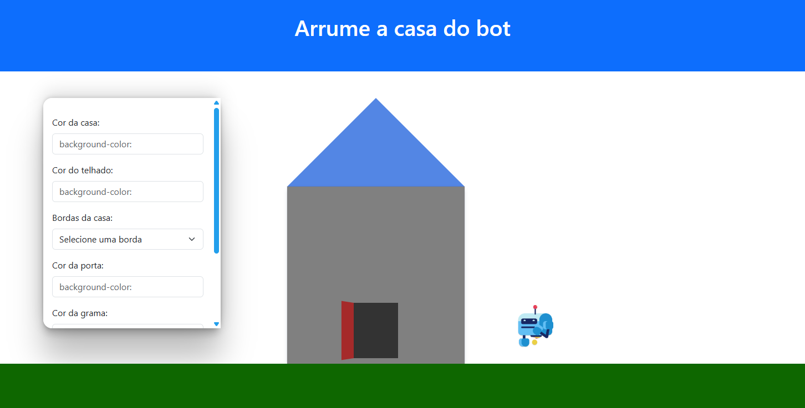

# ⚠️ Código em manutenção
Projeto iniciado em 2023 — a primeira versão era cheia de improvisos, mas agora está sendo refeito do zero com um código muito mais limpo e estruturado.
# 🎮 Jogo do Bot 
Um jogo interativo desenvolvido com HTML, CSS e JavaScript para ensinar conceitos fundamentais de CSS de forma divertida e prática.

📸 Preview

 

🚀 Tecnologias
- HTML5
- JavaScript
- PhaserJS

---

## ▶️ Como usar
1. Clone este repositório:
     
   ```bash
   
   https://github.com/FabioJLimaJ/House-Game.git
